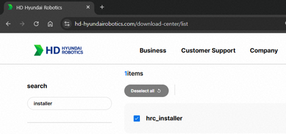

## 2.1 앱 인스톨러 다운로드

### 2.1.1. 앱 인스톨러 설치 과정

1. [HD현대로보틱스 공식 홈페이지의 다운로드 센터](https://hd-hyundairobotics.com/download-center/list)에서 `hrc_installer.zip` 파일을 다운받습니다.  
  
2. USB 메모리(FAT32 포맷 권장)의 최상단(Root) 경로에 압축을 해제합니다.
3. 하기 디렉토리 구조를 확인합니다.

### 2.1.2. 디렉토리 구조 확인

- 하기 디렉토리 구조와 동일한지 확인합니다.
- 하기 4가지 파일 모두 존재하는지 확인합니다.

<div style="max-width:fit-content;">


하기 구조가 반드시 지켜져야 앱 인스톨러가 TP 에서 정상적으로 확인됩니다.


```text
📁 USB_ROOT (USB 최상단)
 ┗ 📁 hi6
    ┗ 📁 apps
       ┗ 📁 Install_Apps
          ┣ 📄 hrc_installer       (인스톨러 실행 파일)
          ┣ 📄 hrc_installer.cfg   (설치 설정 파일)
          ┣ 📄 hrc_installer.png   (인스톨러 아이콘 이미지)
          ┗ 📄 info.json           (앱 정보 파일)
```

</div>
