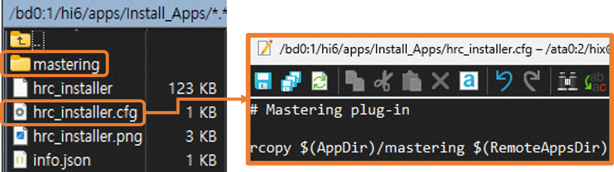
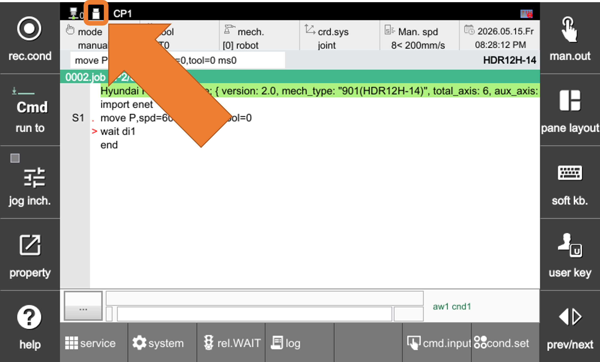
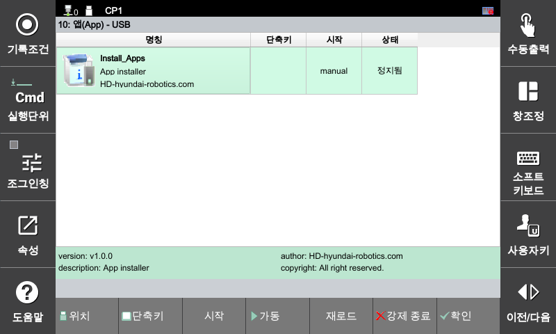
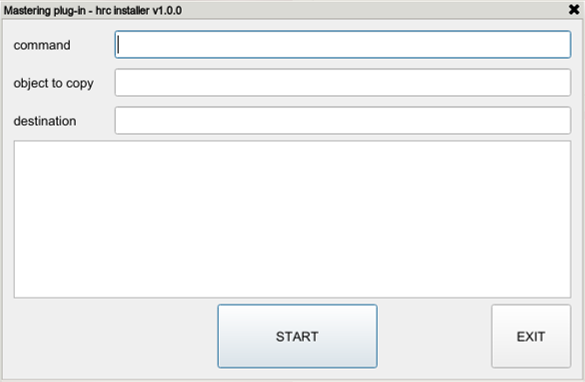
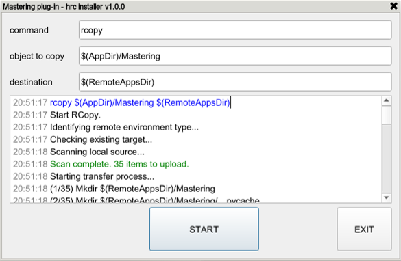

## 3.1 Run Installer

Once the USB is ready, follow the steps below to run the installer.

#### Step 1 

Insert the USB memory stick prepared with the App Installer into the USB port of the TP.

<figure>
  
  <figcaption>Fig 1. Prepared USB folder structure and configuration file contents</figcaption>
</figure>

Check the USB connection status on the TP Home screen.

<figure>
  
  <figcaption>Fig 2. Checking the USB connection status on the taskbar</figcaption>
</figure>

#### Step 2

Verify the App Installer.  
- TP Home > Service > 10: App > Click Location > Click the App Installer you want to install

<figure>
  
  <figcaption>Fig 3. Verifying the Installer</figcaption>
</figure>

#### Step 3 

Click the [F4: Run] button at the bottom of the app screen to execute the installer.

<figure>
  
  <figcaption>Fig 4. Installer execution screen</figcaption>
</figure>

#### Step 4

Click [START] to proceed with the installation.

<figure>
  
  <figcaption>Fig 5-1. Installer start screen</figcaption>
</figure>

<figure>
  
  <figcaption>Fig 5-2. Installer finish screen</figcaption>
</figure>

#### Step 5

Once the installation is complete, click the [Exit] button to close the installer, and then `reboot the controller.`


The installed APP will operate normally only after the controller is rebooted.


