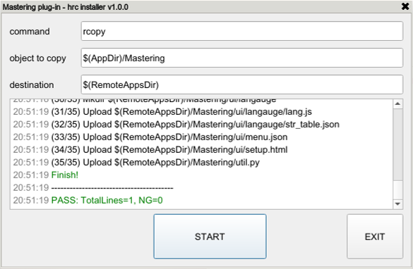
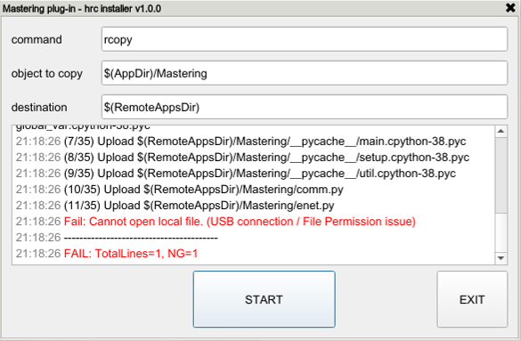

## 3.2 Check Execution Logs

Installation progress and final results can be checked in real-time through the log window in the center of the installer screen.  
You can intuitively understand the status through the text colors.

### 3.2.1 Log Color Guide

- 🔵 Blue: Currently executing command (e.g., xcopy, rcopy, etc.)
- ⚫ Black: Copy progress status and general details
- 🟢 Green: Individual command successfully processed (Pass)
- 🔴 Red: Individual command failed and the reason for the error (Fail)

### 3.2.2 Determining Final Installation Results

- Once all tasks are completed, the final summary result is printed on the very last line of the log window.
- TotalLines refers to the number of command lines entered in `hrc_installer.cfg`.
- Installation Success: 🟢 PASS: TotalLines=[Total number of commands], NG=0  
  -> This means all app installations were completed normally without any errors.

<figure>
  
  <figcaption>Fig 6. Installer normal completion screen</figcaption>
</figure>

- Installation Failure: 🔴 FAIL: TotalLines=[Total number of commands], NG=[Number of failures]  
  -> This means an error occurred in some or all of the commands. Check the red error message above and take action.

<figure>
  
  <figcaption>Fig 7. Installer execution failure screen</figcaption>
</figure>
